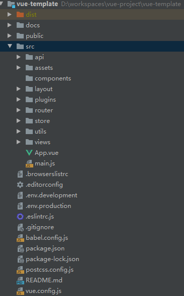

# 基于Vue+Element的开发导航

> 本项目基于Vue+Element搭建的一个基础开发框架



## 项目说明
```
docs --- 文档
src  --- 源码
```

## 开始使用

## 下载依赖
```
npm install
```

### 开发
```
npm run serve
```

### 打包
```
npm run build
```

### Lints and fixes files
```
npm run lint
```
